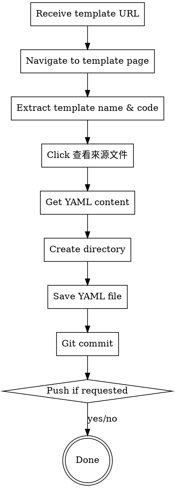

# Zeabur Template Backup

Backup a Zeabur template to the local git repository with standardized naming.

## When to Use

- User provides a Zeabur template URL (e.g., `https://zeabur.com/templates/85IQXQ`)
- User asks to backup/save a Zeabur template
- User wants to create a local copy of a Zeabur template

## Repository Location

```
/Users/can/Documents/zeabur/zeabur-template/
```

## Naming Convention

```
{service-name}/zeabur-template-{service-name}-{TEMPLATE_CODE}.yaml
```

**Examples:**
- `elasticsearch-kibana/zeabur-template-elasticsearch-kibana-85IQXQ.yaml`
- `dify/zeabur-template-dify-1D4DOW.yaml`
- `postiz/zeabur-template-postiz-v2.12-X2L3BE.yaml`

## Workflow



## Step-by-Step

### 1. Extract Template Info from URL

URL format: `https://zeabur.com/templates/{TEMPLATE_CODE}`

Example: `https://zeabur.com/templates/85IQXQ` → Code is `85IQXQ`

### 2. Navigate and Get Template Details

Using browser automation:
1. Navigate to the template URL
2. Read the template name from the page title
3. Find and click "查看來源文件" link to get YAML

### 3. Derive Service Name

- Convert template name to lowercase kebab-case
- Example: "Elasticsearch Single Node with Kibana" → `elasticsearch-kibana`
- Keep it short and descriptive

### 4. Create Directory and Save

```bash
# Create directory
mkdir -p /Users/can/Documents/zeabur/zeabur-template/{service-name}

# Save YAML with naming pattern
# zeabur-template-{service-name}-{TEMPLATE_CODE}.yaml
```

### 5. Git Commit

```bash
git add {service-name}/
git commit -m "feat({service-name}): add {Template Name} template"
```

### 6. Push (if requested)

```bash
git push
```

## Quick Reference

| Step | Action |
|------|--------|
| 1 | Get template URL from user |
| 2 | Navigate to URL with browser |
| 3 | Extract template name and code |
| 4 | Click "查看來源文件" for YAML |
| 5 | Create service directory |
| 6 | Save YAML with proper naming |
| 7 | Git commit with conventional format |
| 8 | Push if user requests |

## Common Issues

| Issue | Solution |
|-------|----------|
| YAML has extra text at end | Clean up browser UI text before saving |
| Template name has special chars | Use simple kebab-case for directory |
| Already exists | Check if update needed or use different name |
